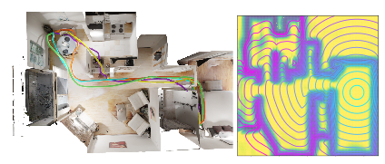

# NTFields

**NTFields: Neural Time Fields for Physics-Informed Robot Motion Planning**
\
[Ruiqi Ni](https://ruiqini.github.io/),
[Ahmed H Qureshi](https://qureshiahmed.github.io/)
\
_[ICLR 2023](https://openreview.net/forum?id=ApF0dmi1_9K) |
[GitHub](https://github.com/ruiqini/NTFields) |
[arXiv](https://arxiv.org/abs/2210.00120)_

Path &nbsp;&nbsp;&nbsp;&nbsp;&nbsp;&nbsp;&nbsp;&nbsp;&nbsp; NTFields
:-------------------------------------------------------------------------------------: 
  

## Introduction

This repository is the official implementation of "NTFields: Neural Time Fields for Physics-Informed Robot Motion Planning". 

## Installation

To install requirements:

```setup
conda env create -f NTFields_env.yml
conda activate NTFields
```

Our model requires PyTorch, Open3D, libigl, pytorch_kinematics, and bvh-distance-queries library.

## Pre-processing

To preprocess the Bunny or Cluttered 3D model in the paper, run this command:

```preprocess
python data_generation/preprocess.py 
```

Sample one million start and goal pairs with speed. Save as `dataset/Bunny/sampled_points.npy`, `dataset/Bunny/speed.npy` or `dataset/C3D/sampled_points.npy`, `dataset/C3D/speed.npy`.

To preprocess the 4-DOF Arm model in the paper, run this command:

```preprocess
python data_generation/arm_preprocess.py 
```

Sample one million start and goal pairs with speed. Save as `dataset/Arm/sampled_points.npy`, `dataset/Arm/speed.npy`.

## Training

To train the Bunny model in the paper, run this command:

```train
python train_bunny.py 
```

First move `dataset/Bunny/sampled_points.npy`, `dataset/Bunny/speed.npy` to `Experiments/Bunny/sampled_points.npy`, `Experiments/Bunny/speed.npy`, then train the model.

To train the Cluttered 3D model in the paper, run this command:

```train
python train_c3d.py 
```

First move `dataset/C3D/sampled_points.npy`, `dataset/C3D/speed.npy` to `Experiments/C3D/sampled_points.npy`, `Experiments/C3D/speed.npy`, then train the model.

To train the 4-DOF Arm model in the paper, run this command:

```train
python train_arm.py 
```

First move `dataset/Arm/sampled_points.npy`, `dataset/Arm/speed.npy` to `Experiments/Arm/sampled_points.npy`, `Experiments/Arm/speed.npy`, then train the model.

## Evaluation

To test our model on Bunny case, run:

```eval
python bunny_path_planning.py 
```

To test our model on Cluttered 3D case, run:

```eval
python c3d_path_planning.py 
```

To test our model on Arm case, run:

```eval
python arm_path_planning.py 
```

Our bidrectional path planning results will be shown in Open3D visualization


## Citation

Please cite our paper if you find it useful in your research:

```
@inproceedings{
    ni2023ntfields,
    title={{NTF}ields: Neural Time Fields for Physics-Informed Robot Motion Planning},
    author={Ruiqi Ni and Ahmed H Qureshi},
    booktitle={International Conference on Learning Representations},
    year={2023},
    url={https://openreview.net/forum?id=ApF0dmi1_9K}
}
```

## Acknowledgement


## License

NTFields is released under the MIT License. See the LICENSE file for more details.


